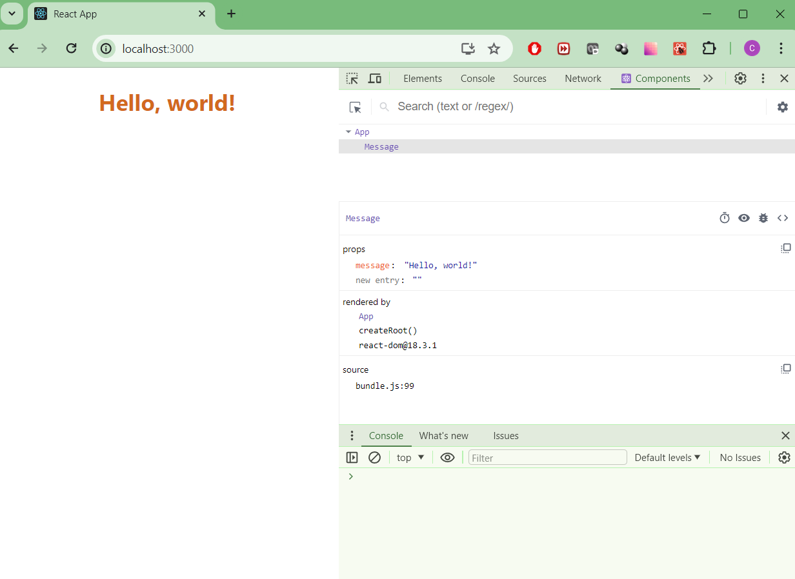

## Task1. Знакомство с React и первые компоненты. Работа с JSX

### Задание
* Развернуть новый проект с использованием create-react-app.
* Создать компонент Message, отображающий переданный ему props текст.
* Стилизовать компоненты через css (при желании можно использовать less или sass).
* Дополнительное задание: Установить расширение React Devtools.

## Решение: 
1. message-app project
2. React Devtools
